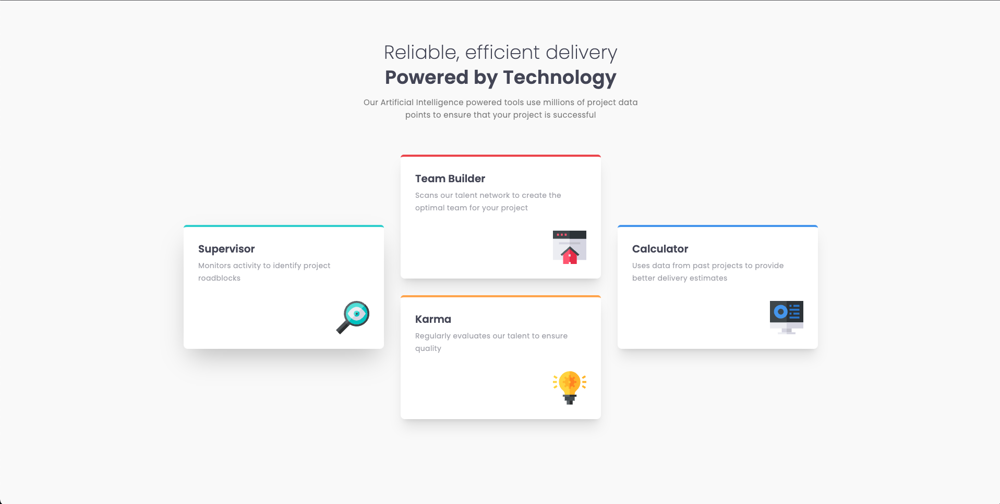

# Frontend Mentor - Four card feature section solution

This is a solution to the [Four card feature section challenge on Frontend Mentor](https://www.frontendmentor.io/challenges/four-card-feature-section-weK1eFYK).

## Table of contents

- [Overview](#overview)
  - [The challenge](#the-challenge)
  - [Screenshot](#screenshot)
  - [Links](#links)
- [My process](#my-process)
  - [Built with](#built-with)
  - [What I learned](#what-i-learned)
- [Author](#author)

## Overview

### The challenge

Users should be able to:

- View the optimal layout for the site depending on their device's screen size

### Screenshot

### Links

- Solution URL: [Github](https://github.com/gumrahsindar/four-card-feature-section)
- Live Site URL: [Vercel](https://four-card-feature-section-gsindar.vercel.app/)

## My process

### Built with

- Semantic HTML5 markup
- CSS custom properties
- Flexbox
- CSS Grid
- Mobile-first workflow
- [React](https://reactjs.org/) - JS library
- [Tailwind CSS](https://tailwindcss.com/) - For styling
- [Vite](https://vitejs.dev/) - Build tool

**Note: These are just examples. Delete this note and replace the list above with your own choices**

### What I learned

The most challenging part of this project was implementing the card layout for the desktop version. To tackle this challenge, I decided to utilize the CSS Grid layout. Firstly, I changed the flow direction of the Grid by using the `grid-auto-flow: column` property. This adjustment arranged the grid items in a column-wise order. Additionally, I applied `grid-row: span 2 / span 2` to both the first and last child elements of the grid, which caused them to span across two rows, providing the desired layout. These modifications successfully resolved the challenges I encountered with the card layout in the desktop version.

## Author

- LinkedIn - [Gümrah Sindar](https://www.linkedin.com/in/gumrahsindar/)
- Frontend Mentor - [@gumrahsindar](https://www.frontendmentor.io/profile/gumrahsindar)
- Twitter - [@gmrhsndr](https://twitter.com/gmrhsndr)
